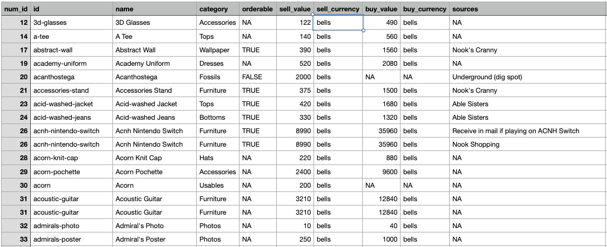
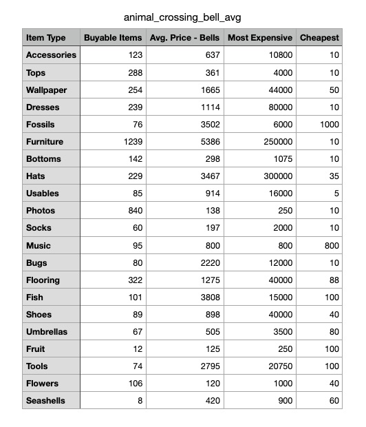

# Parsing data

Data rules the world.

It's everywhere.

Master data, with Python.

## CSV

CSV stands for "Comma-separated values".

CSV is a great format for parsing data!

Let's find some interesting CSV files.

Here are some great resources for free, open datasets:

* [Kaggle](https://www.kaggle.com/datasets)
* [data.gov](https://catalog.data.gov/dataset)
* [GitHub](https://github.com/datasets)

Let's grab this [Animal Crossing item CSV](items.csv) from [Kaggle](https://www.kaggle.com/jessemostipak/animal-crossing)

Open it up in a spreadsheet program like Excel and it will look something like this:



We've got the data, now let's parse it with Python.

## Python CSV

Let's start by importing the `csv` module. This will give us many useful tools to read and write CSV files. Take a look at the [official docs](https://docs.python.org/3/library/csv.html).

We'll create a Python file for parsing our data called `parse_items.py`. Put the following code in the file and try running it. Be sure the items.csv file is in the same directory as your Python script.

```python
import csv
filename = "items.csv"

with open(filename, newline='') as csv_file:
    file_reader = csv.reader(csv_file)
    for row in file_reader:
        print(row)
```

This will loop through each row and print it in a list. Simple but powerful!

## Analyzing Data

Let's say we want to find which item category has the most expensive items. We can refactor our loop to store data from the right columns like this:

```python
import csv
filename = "items.csv"

category_prices = {}

with open(filename, newline='') as csv_file:
    file_reader = csv.reader(csv_file)
    for row in file_reader:
        # PARSE
        category = row[3]    # Column 3
        sell_price = row[5]  # Column 5
        currency = row[6]    # Column 6
        # Check if item has a valid price
        if currency == "bells" and sell_price.isnumeric():
            sell_value = int(sell_price)
            if category in category_prices:
                category_prices[category].append(sell_value)
            else:
                category_prices[category] = [sell_value]

print(category_prices)
```

Running this will fill category_prices with each category and the price of each item in that category. We can use that to determine the average cost of each item, and the number of purchasable items in each item category.

```python
for category in category_prices:
    prices = category_prices[category]
    avg_bells = sum(prices) // len(prices)
    print(f"{category}: {len(prices)} items, {avg_bells} avg. bells")
```

```
Accessories: 123 items, 637 avg. bells
Tops: 288 items, 361 avg. bells
Wallpaper: 254 items, 1665 avg. bells
Dresses: 239 items, 1114 avg. bells
Fossils: 76 items, 3502 avg. bells
Furniture: 1239 items, 5386 avg. bells
Bottoms: 142 items, 298 avg. bells
Hats: 229 items, 3467 avg. bells
Usables: 85 items, 914 avg. bells
Photos: 840 items, 138 avg. bells
Socks: 60 items, 197 avg. bells
Music: 95 items, 800 avg. bells
Bugs: 80 items, 2220 avg. bells
Flooring: 322 items, 1275 avg. bells
Fish: 101 items, 3808 avg. bells
Shoes: 89 items, 898 avg. bells
Umbrellas: 67 items, 505 avg. bells
Fruit: 12 items, 125 avg. bells
Tools: 74 items, 2795 avg. bells
Flowers: 106 items, 120 avg. bells
Seashells: 8 items, 420 avg. bells
```

Nifty!

## Writing data

Not only can we read data but we can write data too. Python has visualization libraries, like [Pandas](https://pandas.pydata.org/) and [Bokeh](https://docs.bokeh.org/en/latest/index.html), or you can just write back to CSV to open in a spreadsheet.

```python
with open('animal_crossing_bell_avg.csv', 'w', newline='') as csvfile:
    fieldnames = ['Item Type', 'Buyable Items', 'Avg. Price - Bells', 'Most Expensive', 'Cheapest']
    writer = csv.DictWriter(csvfile, fieldnames=fieldnames)
    writer.writeheader()
    for category in category_prices:
        prices = category_prices[category]
        writer.writerow({'Item Type': category,
                         'Buyable Items': len(prices),
                         'Avg. Price - Bells': sum(prices) // len(prices),
                         'Most Expensive': max(prices),
                         'Cheapest': min(prices)})
```

Open up the resulting CSV will give you this:



