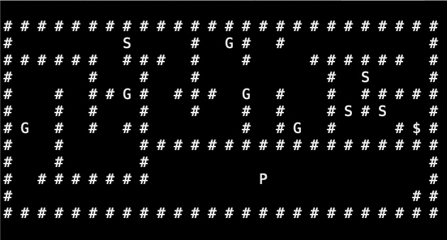
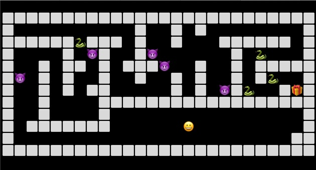

# Game

Run the game using `python game.py`.

A few more features and we're done!

* Framerate
* New object types
  * Player
    * Can be controlled by user input
  * Enemies
    * Move independently
    * Kill the player when they collide
  * Weapon
    * Spawned by player
    * Destroy enemies when they collide
  * Barrier
    * Cannot be passed by anything
  * Treasure
    * Win condition
    * Add gold when collected
* Collision handling
* Load maps from CSV
* Unique graphics for each object


## Framerate

Timing is crucial for games and animation. We can import Python's `time` module to help us build our graphics display.

```python
import time

time.time() # The number of seconds since Jan 1, 1970
# 1590861260.771779
```

Let's wait a few seconds.

```python
time.time()
# 1590861311.3672168
```

Notice that the value of `time.time()` changed after some time had passed. We can also use the `time.sleep()` function to make Python pause for some amount of time.

```python
start_time = time.time()
# 1590861459.577342
time.sleep(5)
end_time = time.time()
# 1590861464.58429
print(f"Slept for {end_time - start_time} seconds.")
# Slept for 5.006947994232178 seconds.
```
Not exact, but pretty close.

## Framerate

Games rely on a steady framerate for consistent behavior. We can accomplish this with `time()` and `sleep()`.

Let's say we want a framerate of 10fps (frames per second). This means we want each frame to take 0.1 seconds. Processing the behavior of 10 dynamic objects on a 24x10 grid and refreshing the display takes approximately 0.005 seconds, so after the processing is done, we sleep for .095 seconds.

Even with a framerate of 60fps (.0167 seconds per frame), processing uses up less than 1/3rd of our frame time, so we are able to achieve a steady framerate.

```python
frame_time = 1 / self.framerate

# Start of the frame
start_time = time.time()

# DO ALL PROCESSING FOR CURRENT FRAME

# This will give you how much time has elapsed in the frame
processing_time = time.time() - start_time

# If frame_time - processing_time is negative, wait_time will be 0
wait_time = max([0, frame_time - processing_time])
time.sleep(wait_time)
```

## New object types

We'll be creating the following objects, which inherit from the base `GameObject` class in [object.py](./object.py):

* [Player](./player.py)
* [Enemy](./enemy.py)
  * [Goblin](./goblin.py)
  * [Snake](./snake.py)
* [Weapon](./weapon.py)
* [Barrier](./barrier.py)
* [Treasure](./treasure.py)

Start with [object.py](./object.py), then take a look at each of these files and try to understand how they extend the base object functionality. Remember Guido Van Rossum's quote, "Code is read more often than it is written."


## Collisions

Because our game is on a simple grid, we can create a rule that no two objects can share the same position. If they do, we call that a collision which can be handled with some simple logic.

Start by thinking of the logic in plain English.

* If a player collides with an enemy, the player is destroyed
* If an enemy collides with a weapon, the enemy is destroyed
* If a player collides with a treasure, the treasure is collected
* Nothing can collide with a barrier

..and so on. The Python code to accomplish this is very similar. For example, take default collision handler in the base `GameObject` class:

```python
if collision_object == "  ":
    # Empty spaces are fine.
    return True
elif collision_object.type == "BARRIER":
    # Nothing can walk through a barrier
    return False
elif collision_object.type == "WEAPON":
    # Anything that walks into a weapon will die
    self.die()
    return False
```

The best Python code is intuitive and readable and the logic should be easily readable by humans.

## Loading maps from CSV

Start by creating a map in your favorite spreadsheet program.


(Note that the colors will not be exported to the CSV.)

Exporting this will give you [maze_map.csv](./data/maze_map.csv) which will be loaded into the game using the same CSV import code from our previous lesson.



## Graphics

The graphics for each unit are loaded from the `Graphics` class in [graphics.py](./graphics.py). Notice there are two categories for each unit: "ascii" and "emoji".

```python
"SNAKE": {
    "ascii": "S ",
    "emoji": "🐍"
}
```
Default is "ascii" but you can change this in the game constructor by modifying this line:

```python
self.graphics = Graphics("emoji", self)
```




Terminal emojis may not be supported by all platforms but give it a try! Ascii will work on every platform.


